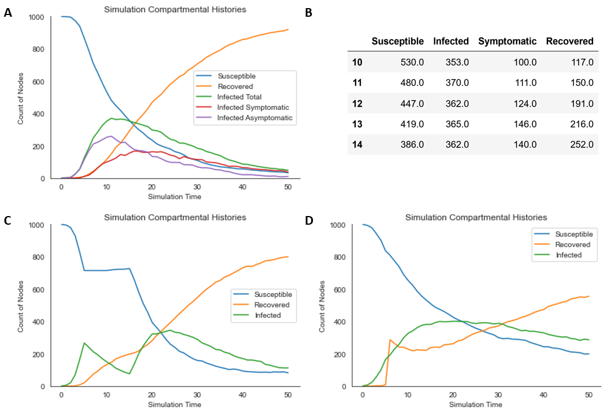

# Summary

The burgeoning intersection of public health, physics, and computer science
research has led to substantial development in the areas of contagion dynamics
and intervention analysis. `contagion` is a network epidemic simulation package
designed to make implementing complex node immunization policies easier.
Additionally, `contagion` implements several features not often available in
comparable software, including:

 - built-in heuristic-based immunization algorithms,
 - partial immunity,
 - time-varying transmission rates,
 - tracking for symptom development,
 - different testing procedures, whose rates can be tuned separately for
 symptomatic/asymptomatic nodes,
 - temporary immunity, whose duration may vary based on how the immunity was
 conferred,
 - delayed immunization, and more.


# Statement of Need

Several packages supporting epidemiological simulations on networks exist, but
few, if any, are dedicated to providing accessible interfaces for node
immunization, which has become an active area of investigation for network
epidemiologists and computer scientists alike. As a result, researchers working
on node immunization projects often cite none of the major simulation toolkits
and must develop their own implementations
[@yang2019efficient][@gong2013efficient][@thedchanamoorthy2014influence].
`contagion` was developed with these researchers in mind, designed to make
immunization-based intervention modeling straightforward and well-integrated in
one standalone susceptible-infected-recovered epidemiological simulation
package. For convenience, `contagion` also provides an array of heuristic-based
immunization algorithms that may be used as baselines.


# Installation

`contagion` is available for installation via the
[PyPI](https://pypi.org/project/contagion/) package repository:

```bash
pip install contagion
```

Alternately, the source code may be downloaded directly from
[GitHub](https://github.com/lucasmccabe/contagion) or Zenodo [@zenodo].

After installation, `contagion` should be imported alongside `NetworkX`:

```python
import networkx
from contagion import contagion
```


# Example Usage

To demonstrate some of `contagion`'s capabilities, we provide a few brief use
cases. For illustrative purposes, we focus on plotting-related
methods; a more detailed overview of functionality is available in the
documentation. Here, all examples use random contact networks generated by the
Barabási–Albert preferential attachment procedure.

We begin with a basic simulation, whereby the contagion has a relatively
aggressive transmission rate (`beta = 0.2`), an average recovery time of 10
time-steps (`gamma = 0.1`), and an average time-to-symptom-development of 5
time-steps (`gamma = 0.2`):

```python
network = contagion.ContactNetwork(
    nx.barabasi_albert_graph(1000, 5))

sim = contagion.Contagion(
    network = network,
    beta = 0.2,
    gamma = 0.1,
    track_symptomatic = True,
    psi = 0.2)

sim.plot_simulation(steps = 50)
```

The resultant rendering is displayed in Figure 1A. Practical details, including
compartmental histories, are recorded as simulation attributes, which can be
retrieved afterward (Figure 1B):

```python
import pandas as pd
df = pd.DataFrame(data = {
    "Susceptible": sim.Su_hist,
    "Infected": sim.In_hist,
    "Symptomatic": sim.Sy_hist,
    "Recovered": sim.Re_hist})
df[10:15]
```

Our second example illustrates time-varying transmission rates, which may be
representative of uniformly-adopted non-pharmaceutical interventions or
seasonal dynamics, and a small probability of immunity loss after recovery
(`omega = 0.01`). The transmission rate (`beta`) is 0.3 for the first 5
time-steps, 0 for the next 10, and 0.3 again for the remainder of the simulation,
resulting in two distinct infection peaks:

```python
network = contagion.ContactNetwork(
    nx.barabasi_albert_graph(1000, 5))

sim = contagion.Contagion(
    network = network,
    beta = [0.3]*5+[0]*10+[0.3],
    omega = 0.01,
    gamma = 0.1)

sim.plot_simulation(steps = 50)
```

The resultant rendering is displayed in Figure 1C.

Finally, we introduce some of `contagion`'s node immunization functionality.
After 5 simulation steps, we immunize half the network according to eigenvector
centrality, using a vaccine with 90% efficacy. In our simulation,
naturally-recovered nodes lose their immunity with probability 0.01, whereas
vaccinated nodes do so with probability 0.1:

```python
network = contagion.ContactNetwork(
    nx.barabasi_albert_graph(1000, 5))

immunization = contagion.Immunization(network)
Im_array = immunization.generate_centrality_immunization_array(
    Q = 500,
    centrality_type='eigenvector',
    order='highest')

network.immunize_network(
    Im = Im_array,
    im_type = "vaccinate",
    im_starts_after = 5,
    efficacy = 0.9)

sim = contagion.Contagion(
    network = network,
    beta = 0.15,
    gamma = 0.05,
    omega = (0.01, 0.1))

sim.plot_simulation(steps = 50)
```

The resultant rendering is displayed in Figure 1D.




# Documentation

Detailed documentation, including a tutorial and API reference, is available on
[ReadTheDocs](https://contagion.readthedocs.io/en/latest/).


# Dependencies

`contagion` was built using `networkx`, `scipy`, `numpy`, `matplotlib`, and
`seaborn`.


# Acknowledgements

We acknowledge helpful input from Ian McCulloh throughout this project. This
software was developed with financial support from the Logistics Management
Institue.


# References
